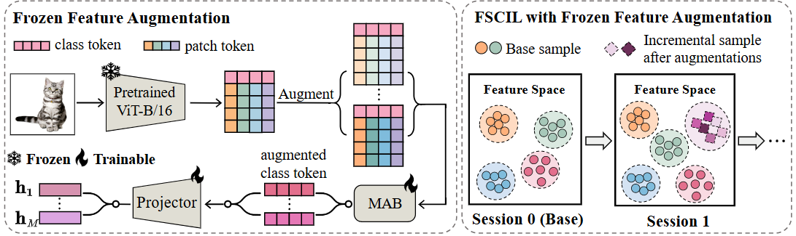
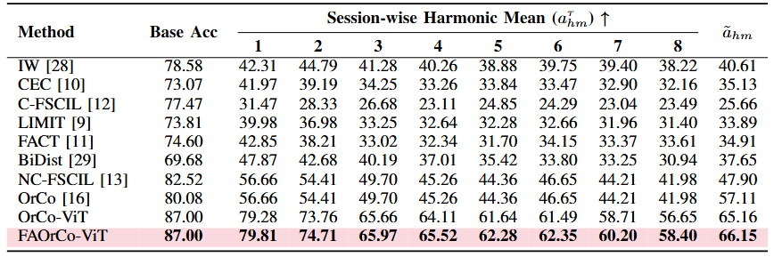

# :page_with_curl: Enhancing Few-Shot Class-Incremental Learning through Frozen Feature Augmentation

This is the *Pytorch Implementation* for the paper:


> **Abstract**:  Few-shot class incremental learning (FSCIL) poses
a significant challenge, as it not only requires mitigating catas-
trophic forgetting but also addressing overfitting. Previous studies
have primarily focused on alleviating these issues through repre-
sentation learning, with the goal of enhancing the separation
between base classes and providing adequate representation
space for incremental classes. As pre-trained models become
increasingly prevalent in continual learning, exploring frozen
feature augmentation for FSCIL becomes extremely necessary.
This work proposes an ingenious brightness-based frozen feature
augmentation method for FSCIL. We validate its effectiveness
on both regular and multi-modal continual learning datasets,
including CIFAR 100, UESTC-MMEA-CL, and ARIC. Not only
that, we analyze the decision attribution stability change afforded
by such a feature augmentation, demonstrating that it does not
compromise interpretability.



## 🔧 Dependencies and Installation
- [PyTorch >= version 1.13.1](https://pytorch.org)
- tqdm
- matplotlib
- pandas
- scikit-learn
- numpy
- prettytable
- timm

**Installation**

First, you can clone this repo using the command:

```shell 
git clone https://github.com/learninginvision/FAOrCo-ViT
```

Then, you can create a virtual environment using conda, as follows:

```shell
conda env create -f environment.yaml
conda activate FAOrCo-ViT
```

## :floppy_disk: Data preparation
We follow [FSCIL](https://github.com/xyutao/fscil) setting and use the same data index_list for training splits across incremental sessions. The datasets are made readily available by the authors of CEC in their github repository [here](https://github.com/icoz69/CEC-CVPR2021?tab=readme-ov-file#datasets-and-pretrained-models). Follow their provided instructions to download and unzip. We assume in our code that the datasets are present inside a `datasets` folder on the same directory level as the cloned repository. If this is not the case then you will need to overwrite the correct path in the shell script.

##  💻 Training
Run the following command to train the model sequentially:


```shell
bash ./scripts/train_cifar100.sh
```


After training, you can get model checkpoints in the folder `./checkpoint_wd0.0/cifar100/orco_vit`.

## 📊 Evaluation
After completing the training, update the "-output_dir" parameter in `./test_scripts/test_cifar100.sh `with the directory where your model is saved. Then, run the following command:
```shell
bash ./test_scripts/test_cifar100.sh
```


The result will be saved in the the directory where your model is saved.

## 📈 Results

<div align="center">


*Results compared with prior work.*
</div>


## 📜 Acknowledgments

Our project references the codes in the following repositories.
- [CEC](https://github.com/icoz69/CEC-CVPR2021)
- [OrCo](https://github.com/noorahmedds/OrCo)

We thank the authors for releasing their code.
